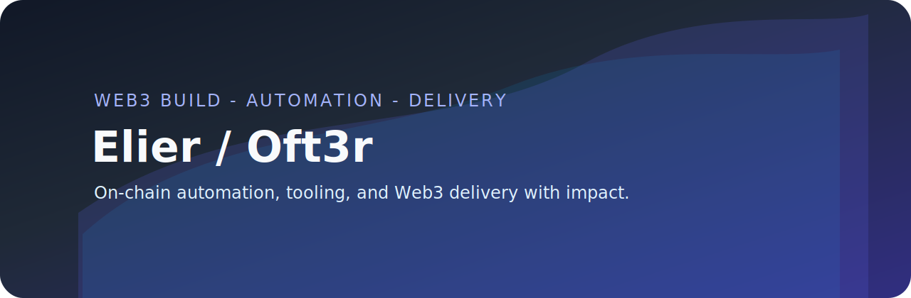

<!--
  README built to position Elier (Oft3r) as a Web3 builder and automation specialist.
  Update metrics, contact links, and visual assets with your production information before publishing.
-->

  

<h1 align="center">Elier / Oft3r - Web3 Builder and Automation Specialist</h1>

  
  
  
  

> Self-taught builder focused on on-chain automation, developer tooling, and clean Web3 user experiences.

---

  
<strong>Interactive tour</strong>

  <ol>
    <li><a href="#value">Why teams choose me</a></li>
    <li><a href="#metrics">Live metrics</a></li>
    <li><a href="#highlights">Auto highlights</a></li>
    <li><a href="#services">Services and engagement</a></li>
    <li><a href="#toolkit">Toolkit</a></li>
  </ol>

## Why teams choose me

  <table>
    <tr>
      <td><strong>On-chain products</strong> Designing and shipping protocols, dapps, and integrations end to end.</td>
      <td><strong>Data and AI</strong> Automation for monitoring channels, chains, and contracts.</td>
      <td><strong>Agile delivery</strong> CI/CD guardrails and custom linters to shrink risk.</td>
      <td><strong>Product craft</strong> From native wallets to ChatOps interfaces for local models.</td>
    </tr>
  </table>

---

## Live metrics

  
  &nbsp;&nbsp;
  

  

  

---

## Auto highlights

  

  
  &nbsp;&nbsp;
  

> Explore all public work directly on the [repositories tab](https://github.com/Oft3r?tab=repositories); the cards above update automatically.

---

## Services and engagement

1. Web3 product development sprints covering wallets, dashboards, and AI powered monitoring surfaces.
2. Automation and monitoring: bots, pipelines, and observability tuned to your stack.
3. Internal tooling: linters, automation, and bots that block regressions before deployment.
4. Technical mentoring for teams entering Web3, design patterns, and production readiness.

---

## Toolkit

  
  
  
  
  
  
  

